# Highly Available 3-Tier AWS Infrastructure

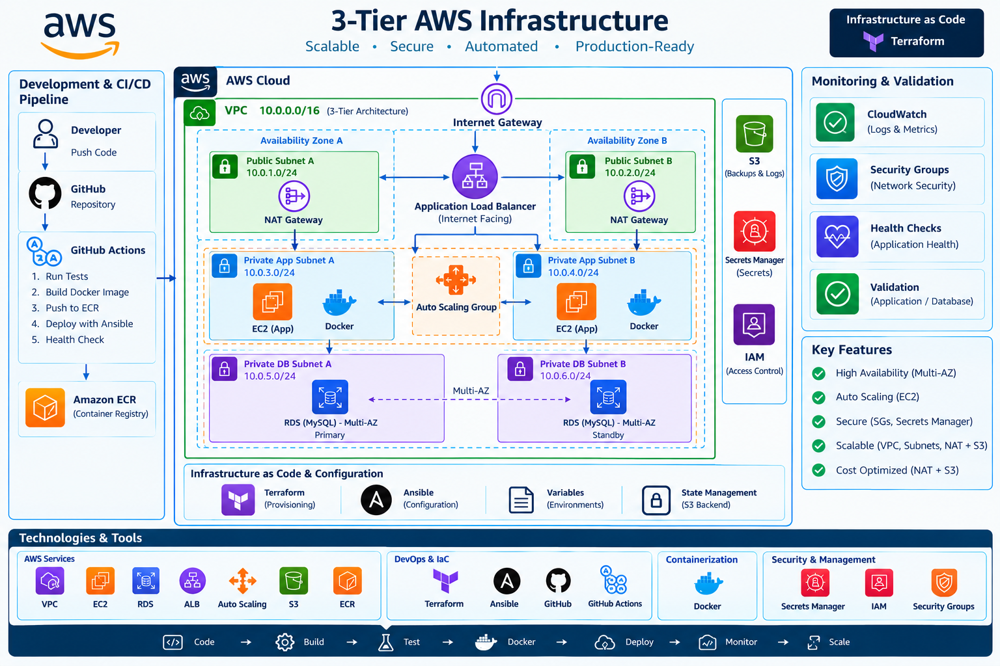

> **Production-style, highly available 3-tier AWS infrastructure built with Terraform, Ansible, Docker, Amazon ECR, and GitHub Actions.**

[](https://www.terraform.io/)
[](https://aws.amazon.com/)
[](https://www.ansible.com/)
[](https://www.docker.com/)
[](https://github.com/features/actions)
[](https://github.com/mohamedgamal546/Highly-Available-3-Tier-AWS-Infrastructure-/actions/workflows/deploy.yml)

## Overview

This project demonstrates the design and implementation of a highly available 3-tier application infrastructure on AWS using Infrastructure as Code and DevOps automation.

The architecture separates the workload into:

* **Presentation Layer** — Public Application Load Balancer
* **Application Layer** — Private EC2 application servers running containerized workloads
* **Data Layer** — Private Amazon RDS MySQL database with Multi-AZ deployment

Infrastructure provisioning is automated with **Terraform**, server configuration and application deployment are handled with **Ansible**, application workloads are containerized with **Docker**, container images are stored in **Amazon ECR**, and CI/CD automation is implemented using **GitHub Actions**.

---

## Architecture

```text
                           Internet
                              │
                              ▼
                    ┌───────────────────┐
                    │  Internet Gateway │
                    └─────────┬─────────┘
                              │
                              ▼
                    ┌───────────────────┐
                    │  Public Subnets   │
                    │                   │
                    │   Application     │
                    │   Load Balancer   │
                    └─────────┬─────────┘
                              │
                    ┌─────────┴─────────┐
                    ▼                   ▼
             ┌──────────────┐    ┌──────────────┐
             │ Private App A│    │ Private App B│
             │    EC2       │    │    EC2       │
             │    Docker    │    │    Docker    │
             └──────┬───────┘    └──────┬───────┘
                    │                   │
                    └─────────┬─────────┘
                              ▼
                    ┌───────────────────┐
                    │   Private RDS     │
                    │    MySQL 8.0      │
                    │     Multi-AZ      │
                    └───────────────────┘

                 Configuration / Automation

        GitHub ──► GitHub Actions ──► ECR
                         │
                         ▼
                    Terraform
                         │
                         ▼
                    AWS Infrastructure

                    Ansible
                         │
                         ▼
               EC2 Configuration
               + Docker Deployment
```

---

## Key Features

### High Availability

* Multi-AZ network architecture
* Application servers distributed across Availability Zones
* Application Load Balancer with health checks
* Amazon RDS Multi-AZ deployment
* Private application and database subnets
* Separation of public, application, and database tiers

### Infrastructure as Code

Terraform manages:

* VPC
* Public and private subnets
* Route tables
* Internet Gateway
* NAT Gateway
* Security Groups
* EC2 instances
* IAM roles and instance profiles
* Application Load Balancer
* Target Group
* Amazon RDS
* Amazon ECR

### Configuration Management

Ansible is used to automate:

* Linux host configuration
* Docker installation
* Application configuration
* Container deployment
* Application image updates

### Containerization

The application is packaged as a Docker image and designed to run as a containerized workload on the private application tier.

### CI/CD

GitHub Actions automates application testing, Docker image build and publishing to Amazon ECR, Ansible connectivity, application deployment, and post-deployment health verification.

---

## Technology Stack

| Category                 | Technologies                            |
| ------------------------ | --------------------------------------- |
| Cloud                    | AWS                                     |
| Infrastructure as Code   | Terraform                               |
| Configuration Management | Ansible                                 |
| Containers               | Docker                                  |
| Container Registry       | Amazon ECR                              |
| Compute                  | Amazon EC2                              |
| Load Balancing           | Application Load Balancer               |
| Database                 | Amazon RDS MySQL                        |
| Networking               | VPC, Subnets, Route Tables, NAT Gateway |
| Identity & Access        | IAM                                     |
| Server Access            | AWS Systems Manager Session Manager     |
| CI/CD                    | GitHub Actions                          |
| Application              | Python                                  |
| Version Control          | Git / GitHub                            |

---

## Repository Structure

```text
.
├── .github/
│   └── workflows/
│       └── ...
│
├── ansible/
│   └── ...
│
├── application/
│   └── ...
│
├── docker/
│   └── app/
│       ├── Dockerfile
│       └── ...
│
├── docs/
│   └── screenshots/
│       ├── alb-target-health.png
│       ├── ansible-validation.png
│       ├── application-health-check.png
│       ├── aws-alb.png
│       ├── ec2-server-a-private-instances.png
│       ├── ec2-server-b-private-instances.png
│       ├── ecr.png
│       ├── github-actions.png
│       ├── nat-gateway.png
│       ├── rds-multi-az-1.png
│       ├── rds-multi-az-2.png
│       ├── s3-validation.png
│       ├── security-groups-alb.png
│       ├── security-groups-app.png
│       ├── security-groups-rds.png
│       └── vpc-resource-map.png
├── terraform/
│   ├── alb.tf
│   ├── ec2.tf
│   ├── iam.tf
│   ├── internet_gateway.tf
│   ├── nat.tf
│   ├── outputs.tf
│   ├── providers.tf
│   ├── rds.tf
│   ├── routes.tf
│   ├── security_groups.tf
│   ├── subnets.tf
│   ├── variables.tf
│   ├── versions.tf
│   └── vpc.tf
│
├── .gitignore
└── README.md
```

---

## Infrastructure Design

### Network Layer

The infrastructure uses a dedicated VPC with CIDR:

```text
10.0.0.0/16
```

The network is divided into multiple subnets across two Availability Zones.

```text
VPC
│
├── Public Subnet A
├── Public Subnet B
│
├── Private Application Subnet A
├── Private Application Subnet B
│
├── Private Database Subnet A
└── Private Database Subnet B
```

This provides network isolation between the application tiers.

### Application Layer

Two EC2 instances are deployed in private application subnets.

The application instances:

* Do not receive public IP addresses
* Run inside private subnets
* Use Docker for application execution
* Use AWS Systems Manager for administrative access
* Receive traffic through the Application Load Balancer

### Database Layer

Amazon RDS MySQL is deployed in private database subnets.

Configuration includes:

```text
Engine:          MySQL 8.0
Storage:         gp3
Storage Size:    20 GB
Multi-AZ:        Enabled
Public Access:   Disabled
```

The database is isolated from direct internet access.

---

## Security Design

Security was implemented using network segmentation and controlled communication between tiers.

```text
Internet
   │
   ▼
ALB
   │
   ▼
Application EC2
   │
   ▼
RDS MySQL
```

Security controls include:

* Public access limited to the Application Load Balancer
* Application servers deployed without public IP addresses
* RDS configured as non-public
* Dedicated security groups for ALB, application, and database tiers
* IAM roles for EC2 access to AWS services
* AWS Systems Manager instead of direct public SSH access
* Secrets Manager integration for database credentials

---

## CI/CD Workflow

The project integrates GitHub Actions into the application delivery workflow.

```text
Developer
    │
    ▼
Git Push to main
    │
    ▼
GitHub Actions
    │
    ├── Application Smoke Test
    │
    ├── AWS Authentication
    │      └── OIDC → IAM Role
    │
    ├── Docker Build
    │
    ├── Push Image → Amazon ECR
    │
    ├── Ansible Environment Setup
    │      └── AWS Collection + SSM Plugin
    │
    ├── Ansible EC2 Connectivity
    │
    ├── Deploy via AWS SSM
    │
    └── Post-Deployment Health Check
```

The workflow automatically tests the application, builds and publishes the Docker image to Amazon ECR, verifies EC2 connectivity through Ansible and AWS Systems Manager, deploys the application, and performs a post-deployment health check.

---

## Validation & Testing

The infrastructure was validated using both Terraform checks and AWS service-level verification.

### Terraform Validation

```bash
terraform init
terraform fmt -check
terraform validate
terraform plan
```

The Terraform configuration was successfully initialized and validated.

### AWS Validation

The deployed architecture was verified through AWS CLI and AWS Management Console checks, including:

* VPC and subnet configuration
* Route tables
* Security Groups
* EC2 instances
* Systems Manager connectivity
* Application Load Balancer
* Target Group health
* RDS configuration
* ECR repository
* IAM instance role

### Cleanup Verification

After testing, project resources were removed from AWS to avoid unnecessary ongoing cloud costs.

The default AWS VPC was intentionally left untouched.

---
## AWS Deployment Evidence

The repository includes deployment and validation evidence captured from the AWS Management Console, application validation, automation workflows, and infrastructure configuration.

### VPC & Resource Map

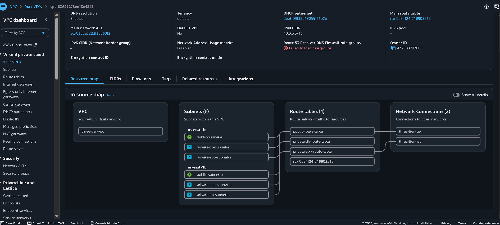

The VPC resource map shows the deployed network topology, including public and private subnets, route tables, Internet Gateway, NAT Gateway, and resources distributed across Availability Zones.

### NAT Gateway

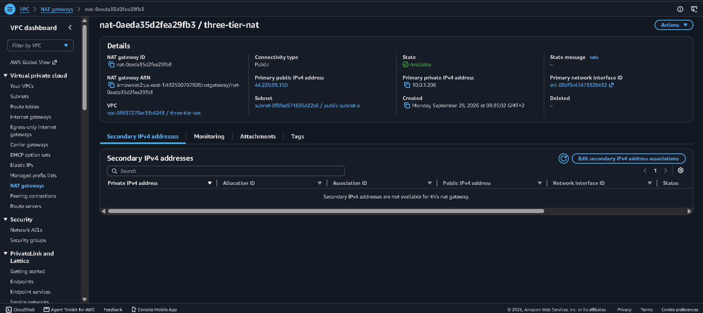

The NAT Gateway provides outbound Internet connectivity for resources deployed in private subnets.

### Security Groups

#### Application Load Balancer

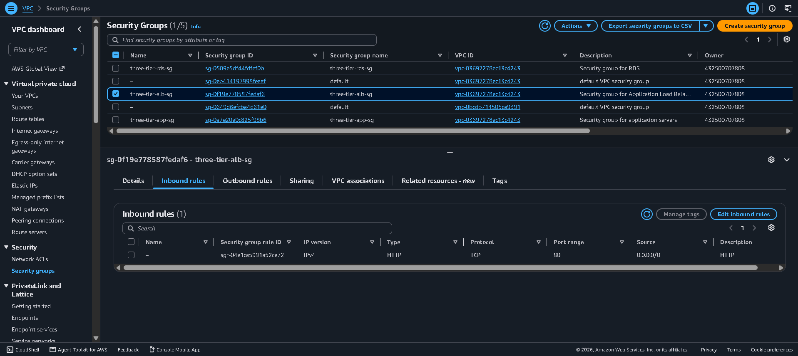

#### Application Tier

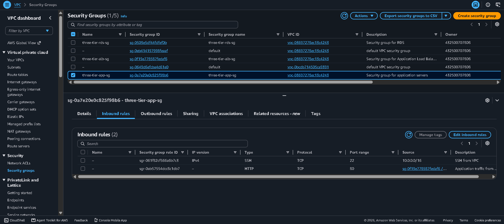

#### Database Tier

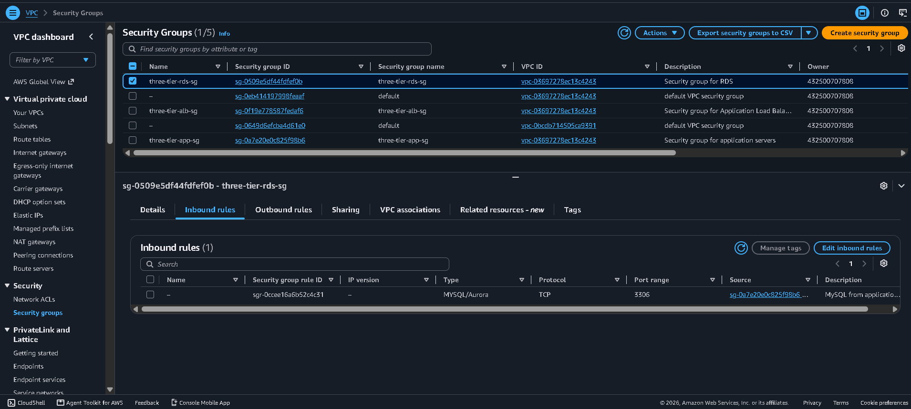

The security groups enforce controlled communication between the Internet-facing load balancer, private application servers, and private database tier.

### Private EC2 Application Servers

#### Application Server A


#### Application Server B

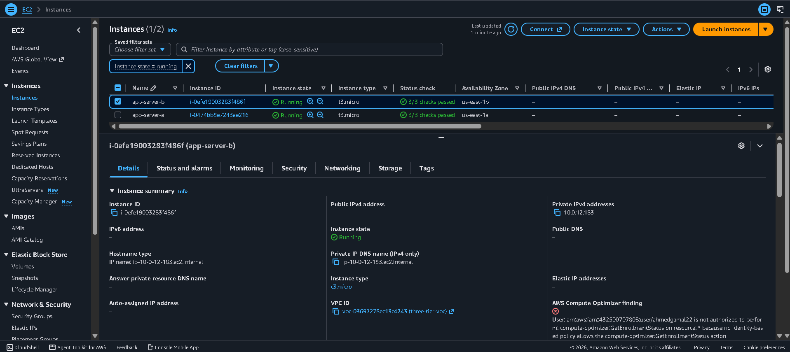

The application servers are deployed in private subnets without public IP addresses.

### Application Load Balancer

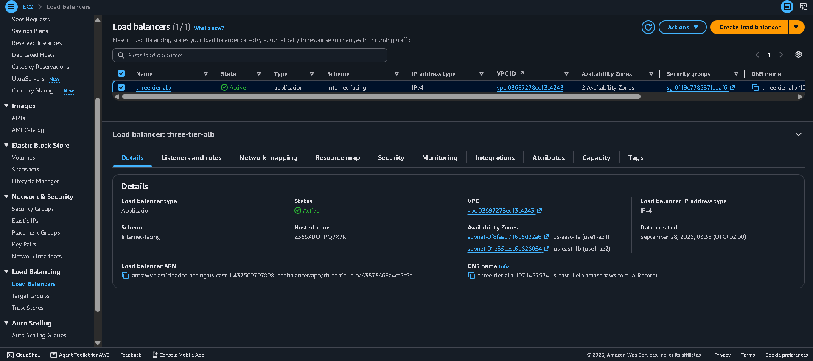

The Application Load Balancer provides the public entry point and distributes traffic to the private application instances.

### ALB Target Health

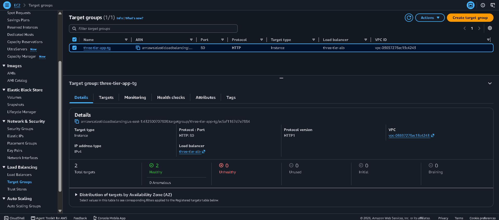

The target group health check confirms that the application targets are healthy and available behind the load balancer.

### Amazon RDS Multi-AZ

#### RDS Configuration

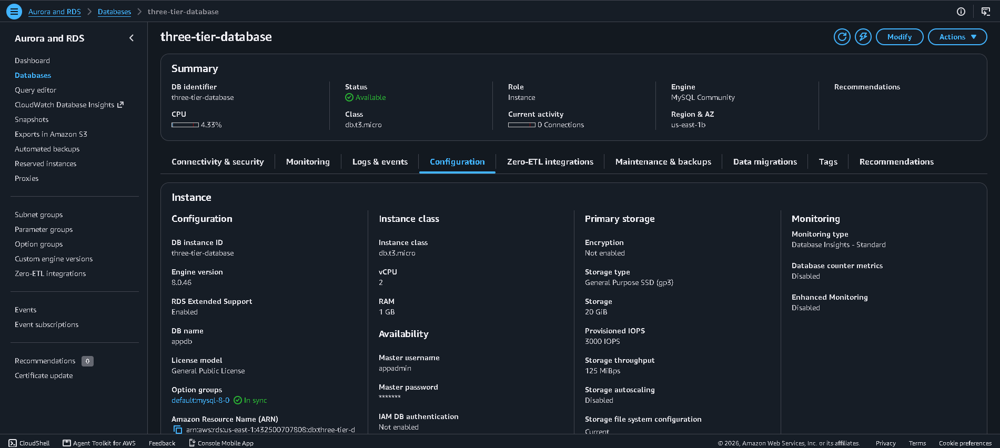

#### RDS Availability

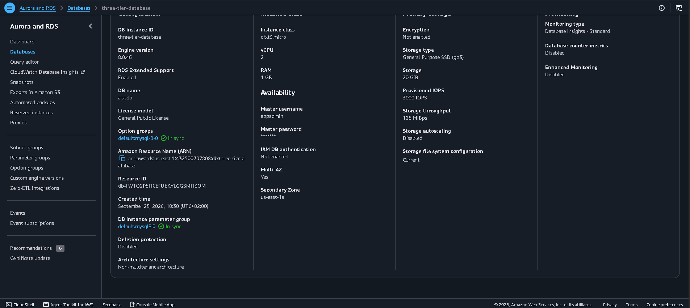

The database tier uses Amazon RDS for MySQL with Multi-AZ deployment and private network placement.

### Amazon ECR

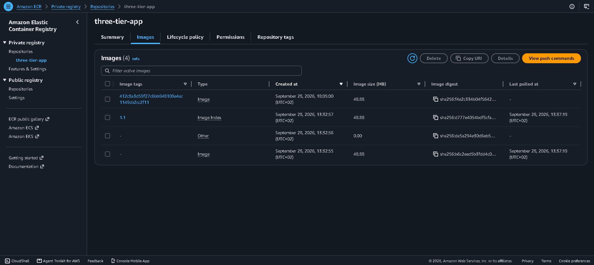

Amazon ECR is used as the container image registry for the application workload.

### GitHub Actions

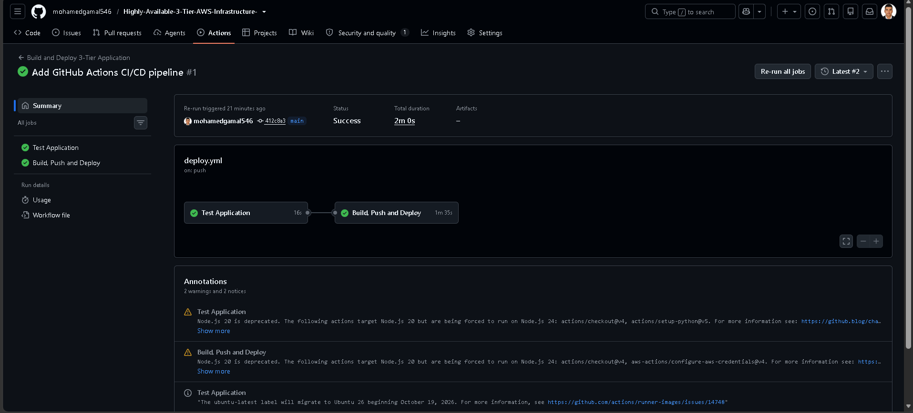

GitHub Actions automates the CI/CD workflow for the project.

### Ansible Validation

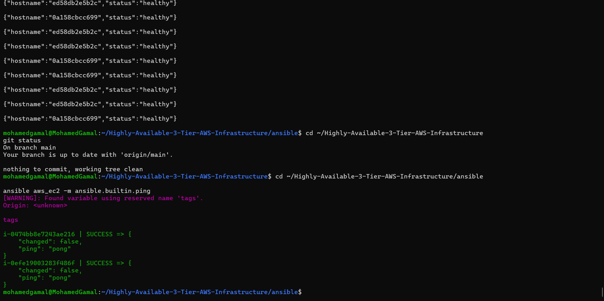

The Ansible validation evidence demonstrates configuration and deployment automation on the application hosts.

### Application Health Check

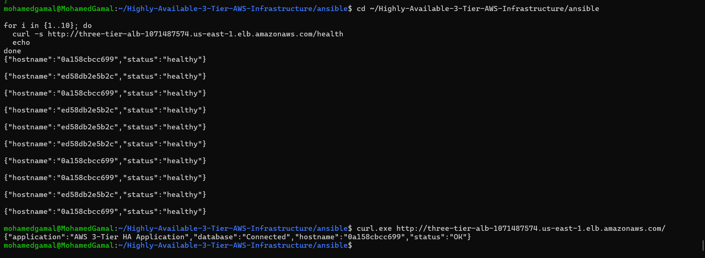

The application health check confirms that the deployed application is responding successfully.

### S3 Validation

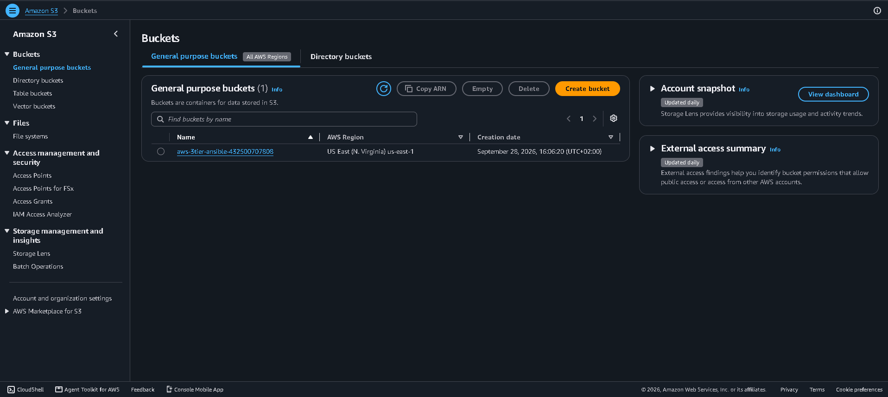

S3 validation evidence documents the project's AWS storage/service validation activity.


## Project Validation Evidence

The project was tested from infrastructure provisioning through application deployment and AWS resource validation.

Evidence includes:

* Terraform validation output
* Terraform plan
* AWS infrastructure configuration
* Private EC2 deployment
* ALB target health
* RDS Multi-AZ configuration
* ECR image repository
* Systems Manager connectivity
* GitHub Actions workflow execution

The screenshots are included in the repository under:

```text
docs/screenshots/
```

---

## Deployment

### Prerequisites

* AWS account
* AWS CLI
* Terraform
* Ansible
* Docker
* Git
* An existing EC2 key pair
* AWS credentials configured locally

### Terraform

```bash
cd terraform

terraform init
terraform fmt -check
terraform validate
terraform plan
```

### Ansible

After infrastructure provisioning, configure the application hosts using the Ansible playbooks under:

```text
ansible/
```

### Application

Build the Docker image:

```bash
docker build -t three-tier-app ./docker/app
```

Push the image to Amazon ECR and deploy it to the application tier using the project automation.

---

## Cost & Cleanup

This project was created as a hands-on AWS lab and is **not intended to leave production resources running continuously**.

After validation, AWS resources created for the project were removed.

To clean up a deployment managed by Terraform:

```bash
terraform destroy
```

> **Important:** Never commit AWS credentials, database passwords, private keys, Terraform variable files containing secrets, or other sensitive information to the repository.

---

## What This Project Demonstrates

This project demonstrates practical experience with:

* AWS cloud infrastructure design
* Multi-AZ architecture
* Infrastructure as Code
* Terraform
* Ansible automation
* Docker containerization
* Amazon ECR
* Application Load Balancing
* EC2 private networking
* Amazon RDS Multi-AZ
* IAM roles
* AWS Systems Manager
* GitHub Actions
* Linux administration
* Network segmentation
* Cloud infrastructure troubleshooting
* Infrastructure validation and cleanup

---

## Author

**Mohamed Gamal Nasser**

System Administration | Cloud | DevOps

* GitHub: [mohamedgamal546](https://github.com/mohamedgamal546)
* LinkedIn: [Mohamed Gamal Nasser](https://www.linkedin.com/in/mohamed-gamal546/)

---

## License

This project is provided for educational and portfolio purposes.
